# 00\. 全文导读与学习流程图｜AI Agent 智能体全链路技术文档

## 一、文档整体定位

本文档合集为**2026工业级 AI Agent 全链路落地权威手册**，共8篇核心章节，覆盖从**基础认知 → 数据建设 → 模型训练微调 → 效果评测 → 开源落地商业化**的完整闭环。

区别于网上碎片化、理论化的AI教程，本套文档主打**工程落地、流水线闭环、商用标准、避坑实战**，专为想要从零搭建、训练、部署、运营属于自己专属AI Agent的开发者、工程师、技术团队打造。

整套文档核心宗旨：**拒绝纸上谈兵，从0到1打通可训练、可部署、可商用、可变现的AI Agent完整体系。**

## 二、整套文档核心解决的行业痛点

- **痛点1：知识碎片化**：多数教程只讲调用、不讲数据；只讲微调、不讲评测；只讲技术、不讲落地，无法形成闭环。

- **痛点2：模型高分低能**：通用大模型评测分数高，但不会工具调用、不会多步骤规划、落地频繁翻车。

- **痛点3：数据成本高昂**：真实标注数据稀缺、成本极高，不懂工业级数据合成体系，无法规模化迭代。

- **痛点4：训练微调不专业**：通用LLM训练方式不适配Agent，导致模型遗忘、幻觉暴涨、执行能力崩坏。

- **痛点5：无标准化评测体系**：无法量化Agent真实能力，迭代全靠感觉，版本优劣无法对比。

- **痛点6：技术落地即终结**：只会开发不会开源、不会引流、不会商业化，项目无法沉淀生态与价值。

## 三、完整学习链路流程图（Markdown 标准流程图）

以下为整套8章文档**强制学习顺序与工程落地流水线**，所有环节层层递进、环环相扣，不可颠倒：

```mermaid

flowchart LR
    A["00.导读（全局认知）"] --> B["01.基础认知框架选型"]
    B --> C["02.数据体系搭建预训练/后训练规范"]
    C --> D["03.数据合成方法低成本量产高质量样本"]
    D --> E["04.模型训练Agent专属四维训练范式"]
    E --> F["05.模型微调LoRA/QLoRA轻量化落地"]
    F --> G["06.模型评估工业级量化评测体系"]
    G --> H["07.开源打包标准化工程发布"]
    H --> I["08.推广商业化生态沉淀+流量变现"]
    style A fill:#f0f8ff,stroke:#4169e1
    style I fill:#f0fff0,stroke:#32cd32
    
```

## 四、分章节核心作用与学习目标（全8章精讲）

为方便快速定位学习，下面梳理每一章的**核心定位、不可替代价值、学习目标**：

### 01 基础认知 \& 框架选型

**定位**：地基认知层，告别盲目开发。

**核心价值**：厘清Agent与普通大模型的本质区别，掌握2026主流框架、协议（MCP/A2A）、架构范式，选对技术路线，避免从一开始走弯路。

### 02 数据体系

**定位**：Agent能力上限层。

**核心价值**：数据决定Agent落地稳定性，本章搭建预训练、SFT、RL、负样本全套数据规范，解决数据杂乱、样本无效、训练翻车问题。

### 03 数据合成方法

**定位**：低成本量产核心。

**核心价值**：摆脱对人工标注、开源数据集的依赖，实现工具调用、规划、反思、多智能体数据自动化量产，支撑模型持续迭代。

### 04 模型训练

**定位**：能力塑造核心。

**核心价值**：区分通用LLM训练与Agent行动式训练，掌握结构化SFT、轨迹训练、反思RL、DPO对齐四大工业范式，让模型真正“会做事、能落地”。

### 05 模型微调

**定位**：轻量化落地核心。

**核心价值**：基于LoRA/QLoRA低成本微调，分层优化Agent能力，杜绝灾难性遗忘，适配低显存、个人/企业全场景部署。

### 06 模型评估

**定位**：迭代优化标尺。

**核心价值**：摒弃传统LLM刷题评测，建立Agent专属的任务完成率、幻觉率、调用准确率、重规划能力量化体系，让每一次迭代都有数据支撑。

### 07 模型开源

**定位**：工程标准化收尾。

**核心价值**：规范仓库结构、权重打包、合规声明、多平台上架，让项目从“练手代码”升级为“工业级开源项目”。

### 08 推广与商业化

**定位**：价值变现闭环。

**核心价值**：解决技术落地最后一公里，实现流量增长、生态沉淀、授权变现、私有化部署盈利，让技术产生商业价值。

## 五、三类人群学习建议

### 1\. 新手入门（零基础）

严格按照**00→01→02→03→04→05→06→07→08**顺序通读，先建立全局认知，再动手实操，快速搭建完整Agent知识体系，避免碎片化学习。

### 2\. 有大模型基础、不会Agent落地

重点精读 **02、03、04、06**，重点理解Agent数据体系、行动式训练、专属评测逻辑，打破传统LLM思维，快速适配工程落地范式。

### 3\. 工程师/团队商业化落地

全章精读，重点落地 **数据合成流水线、分层微调、自动化评测、开源合规、商业化方案**，可直接复用整套工业级流程搭建团队项目。

## 六、全书核心总结

本套8章文档构建了 **2026年最完整的AI Agent工业化落地闭环**：

**认知筑基 → 数据造血 → 训练塑能 → 微调专精 → 评测控稳 → 开源标准化 → 商业变现**

AI Agent行业竞争早已不是模型参数的比拼，而是**数据体系、工程落地能力、稳定性、生态运营、商业化能力**的全方位竞争。掌握本套全链路体系，即可独立完成从0到1的工业级AI Agent项目搭建、迭代与商业落地。
