# 00 Agent工程总览 (Overview)

> Agent工程全景图、技术栈概览、发展趋势

**内容重点**: 宏观视角，建立全局认知

---

## 1. 章节总览
本模块聚焦现代AI Agent工程化全栈知识，覆盖从概念、模型训练、数据流水线、底层基础设施、训练框架工程、能力调优、知识蒸馏、评测基准、开源资源到落地案例。
面向研发人员、AI产品工程师、二次开发爱好者，内容偏向**2026工业落地视角**，兼顾理论深度与工程实操，不做浅度科普。

### 适用人群
- 想要自研/微调Agent基座的算法工程师
- Agent应用开发，希望理解底层训练逻辑的全栈开发者
- AI产品、TPM，需要建立Agent完整技术认知框架
- 科研爱好者，梳理Agent工程完整链路

### 前置知识要求
1. 了解大语言模型基础概念，熟悉LLM微调基本术语（SFT、LoRA、DPO等）
2. 基础Python、GPU训练、Linux使用经验
3. 理解Prompt‑Agent、Tool‑calling基本运行逻辑

## 2. 整套文档链路总览

```mermaid
flowchart LR
    A["00‑Overview<br/>总览"] --> B["01‑Core‑Concepts<br/>核心概念"]
    B --> C["02‑Agent‑Model‑Training‑Agent<br/>Agent模型训练"]
    C --> D["03‑Agent‑Data‑Pipeline‑Agent<br/>Agent数据流水线"]
    D --> E["04‑Agent‑Infrastructure‑Agent<br/>Agent基础设施"]
    E --> F["05‑Harness‑Engineering<br/>训练框架工程"]
    F --> G["06‑Capability‑Engineering<br/>Agent能力工程"]
    G --> H["07‑Knowledge‑Distillation<br/>知识蒸馏"]
    H --> I["08‑Evaluation‑Benchmarks<br/>评测与基准"]
    I --> J["09‑Code‑Data‑Resources<br/>代码&数据集资源"]
    J --> K["10‑Applications‑Case‑Studies<br/>应用与案例研究"]
```

## 3. 各文档简短说明

| 文件名 | 核心主题 |
| --- | --- |
| 00‑Overview.md | 本文件，整套章节总览、阅读指引、整体链路 |
| 01‑Core‑Concepts.md | Agent核心概念辨析：范式分类、组件拆解、主流技术路线对比 |
| 02‑Agent‑Model‑Training‑Agent.md | Agent模型训练完整链路：SFT / DPO / PPO‑RL、微调范式对比、训练准入条件 |
| 03‑Agent‑Data‑Pipeline‑Agent.md | Agent专属数据工程：数据源、合成、清洗、过滤、采样、版本管理、数据集坑点 |
| 04‑Agent‑Infrastructure‑Agent.md | Agent基础设施：单/多卡分布式、存储、缓存、MCP/LangGraph、推理‑训练一致性 |
| 05‑Harness‑Engineering.md | 训练框架工程：TRL、Accelerate、PEFT、自定义训练harness、断点续训、流水线封装 |
| 06‑Capability‑Engineering.md | Agent能力工程：工具调用、规划、反思纠错、多智能体、能力退化治理 |
| 07‑Knowledge‑Distillation.md | Agent知识蒸馏：轨迹蒸馏、小Agent对齐大Agent、蒸馏数据集构造、蒸馏避坑 |
| 08‑Evaluation‑Benchmarks.md | Agent评测体系：自动基准、人工评测、指标体系、评测集构建、结果分析 |
| 09‑Code‑Data‑Resources.md | 开源仓库、数据集、模型、论文清单，可直接复用的资源集合 |
| 10‑Applications‑Case‑Studies.md | 真实落地案例、不同场景Agent选型、成本收益分析、风险总结 |

## 4. 两种阅读路径

### 🚀 工程落地路径（推荐绝大多数开发者）

`00‑Overview` → `01‑Core‑Concepts` → `02‑Agent‑Model‑Training‑Agent` → `03‑Agent‑Data‑Pipeline‑Agent` → `04‑Agent‑Infrastructure‑Agent` → `05‑Harness‑Engineering` → `06‑Capability‑Engineering` → `08‑Evaluation‑Benchmarks` → `09‑Code‑Data‑Resources` → `10‑Applications‑Case‑Studies`

> 
> 知识蒸馏 `07‑Knowledge‑Distillation` 属于高阶可选，小模型轻量化场景再阅读。

### 📚 理论调研路径

顺序通读全部文档，适合做技术调研、方案设计。

## 5. 工程铁律（前置重要提醒）

> 
> [!IMPORTANT]
> 
> 
> 1. Agent质量上限由**数据集质量**决定，其次是训练流程，最后才是基座模型。
> 2. 禁止跳过SFT直接DPO/RL，极易造成工具调用范式崩坏。
> 3. Agent训练与推理必须保证范式一致性：训练时的prompt模板、工具描述格式，推理侧必须完全对齐。
> 4. 评测不能只看loss，必须做Agent业务维度的case‑by‑case验证。

## 6. 仓库与网站信息

- GitHub仓库：[https://github.com/momozi1996/awesome‑ai‑knowledge](https://github.com/momozi1996/awesome%E2%80%91ai%E2%80%91knowledge)
- 文档形态：GitHub Markdown，可直接部署为VitePress静态知识网站。

## 7. 章节小结

本Overview建立整套Agent工程模块的全局视图。
下一篇：**01‑Core‑Concepts.md**，系统梳理Agent核心概念、范式、组件与路线对比。

