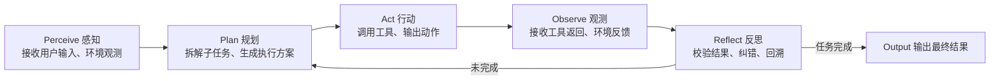

# 01 Agent核心概念 (Core Concepts)

> Agent定义、架构模式、关键术语、设计原则


---

## 1. 本章定位
本章为Agent工程的概念底座，厘清行业混杂术语，拆解Agent基础组件，对比不同技术范式。
目标：消除概念歧义，为后续训练、数据、基础设施章节建立统一术语体系。

## 2. 什么是AI Agent
AI Agent是具备**感知‑规划‑工具行动‑观测‑反思迭代**闭环能力的智能实体。
不只是简单问答，它可以自主拆解复杂目标，调用外部工具，基于返回结果修正决策，逐步完成多步骤任务。

### Agent核心闭环


> 
> 闭环是Agent与普通Chat‑LLM最本质区别：普通大模型单次生成；Agent是多轮循环迭代。

## 3. Agent三大实现范式对比

| 范式 | 核心实现方式 | 能力来源 | 优势 | 短板 | 适用场景 |
| --- | --- | --- | --- | --- | --- |
| Prompt‑Agent（提示词Agent） | 纯Prompt+框架（LangGraph/MCP），基座模型不做微调 | Prompt约束、外部框架调度 | 开箱即用，无需GPU训练，迭代快 | 稳定性弱，长任务容易偏离格式；受基座原生能力约束 | 快速原型、业务应用、工具数量少场景 |
| Fine‑Tuned‑Agent（微调Agent） | 对基座做SFT/DPO/RL微调，固化思维+工具调用范式 | 模型权重内化Agent逻辑 | 输出格式稳定，长轨迹鲁棒性强；降低对Prompt强依赖 | 需要GPU算力；数据集建设成本高；版本迭代需要重训 | 高并发生产环境、复杂多步骤任务 |
| Hybrid‑Agent（混合Agent） | 微调基座 + 外部框架调度结合 | 权重内化基础范式，框架做复杂流程控制 | 兼顾稳定性与灵活调度 | 系统复杂度最高；需要保证训练推理范式对齐 | 工业级生产Agent，绝大多数落地产品选择 |

> 
> [!IMPORTANT]
> 本套文档重点围绕 **Fine‑Tuned‑Agent 与 Hybrid‑Agent** 展开，也就是需要模型训练的Agent；纯Prompt工程仅做对比参考。

## 4. Agent标准组件拆解

一个完整Agent系统分为**模型侧组件**与**框架调度侧组件**。

### 4.1 模型侧（LLM本身，可通过微调优化）

1. **Thought 思考模块**：内部推理，任务拆解、风险判断、决策逻辑；不直接暴露给用户。
2. **Tool‑call Parser 工具调用输出层**：输出结构化动作（JSON），定义调用哪个工具、入参是什么。
3. **Reflection 反思模块**：对工具返回结果做判断，识别失败、错误、信息不足，决定重试/换工具/直接回答。

> 
> 微调Agent就是让模型权重学会稳定输出Thought+ToolCall+Reflection这套表达范式。

### 4.2 调度框架侧（外部程序，LangGraph/MCP等，不改动模型权重）

1. **Tool Registry 工具注册中心**：管理工具元信息、入参schema、权限、限流。
2. **Execution Runtime 执行运行时**：执行工具调用，处理IO、超时、异常捕获。
3. **Memory 记忆模块**：短期上下文记忆、长期向量记忆、会话状态管理。
4. **State 状态机**：维护Agent会话状态，控制循环终止条件，防止无限循环。

```
flowchart TB
subgraph LLM_Model["模型侧（可微调）"]
Thought["Thought 内部思考"]
ToolOut["Tool‑call 结构化输出"]
Reflect["Reflection 反思判断"]
end

subgraph Framework["调度框架侧（外部代码）"]
ToolReg["Tool Registry 工具注册"]
Runtime["Execution Runtime 执行器"]
Memory["Memory 记忆系统"]
State["State 状态机控制器"]
end

User((User Input)) --> Thought
Thought --> ToolOut
ToolOut --> ToolReg
ToolReg --> Runtime
Runtime -->|工具返回观测| Reflect
Reflect -->|继续任务| Thought
Reflect -->|结束任务| User
Memory -.-> Thought
State -.->|控制循环终止| Reflect
```

## 5. 关键概念辨析（消除行业歧义）

### 5.1 ReAct / Reflexion / ToolLLM

- **ReAct**：经典范式，`Thought → Action → Observation`，基础单轮思考行动闭环；
- **Reflexion**：在ReAct基础上增强反思，支持自我批判、重试、错误回溯；
- **ToolLLM**：一套Agent微调数据集与训练方案，代表把工具调用能力内化进模型权重。

> 
> ReAct、Reflexion属于**推理范式**，既可以用Prompt实现，也可以通过SFT微调固化到权重。

### 5.2 Single‑Agent vs Multi‑Agent

- **Single‑Agent**：单个模型实例完成全部思考、规划、工具调用；绝大多数业务Agent属于此类。
- **Multi‑Agent**：多个Agent角色分工协作（规划Agent、工具Agent、评审Agent），依赖框架编排；注意：多智能体是上层应用架构，**不等于需要微调多个不同模型**。

### 5.3 Agent OS 概念

Agent OS不是独立操作系统，是一套整合层概念：统一工具协议(MCP)、记忆管理、状态调度、模型接入层，向下对接各类LLM，向上承接Agent应用。

## 6. Agent能力分层

从基础到高阶，能力存在严格依赖关系，下层不达标上层完全无法生效：

1. **L1 基础格式能力**：稳定输出合法工具调用JSON，角色、语法无错误。
2. **L2 基础工具决策**：判断什么时候调用工具、选对工具、填写合理参数。
3. **L3 规划拆解能力**：复杂任务拆解成有序子步骤，按顺序执行。
4. **L4 反思纠错能力**：识别工具返回错误，重试、修正参数、放弃无效路径。
5. **L5 长上下文与记忆能力**：多轮会话、跨会话复用历史信息。
6. **L6 多智能体协作能力**：多角色分工完成超大复杂任务。

> 
> [!WARNING]
> 训练Agent时，能力必须逐层建设。很多项目直接追求L3/L4规划反思，但是L1格式能力都不达标，最终系统完全不可用。

## 7. 训练侧与推理侧核心鸿沟

> 
> 这是Agent工程最高频踩坑点。

- 训练侧：训练数据里的prompt模板、thought格式、toolcall JSON schema、角色标记。
- 推理侧：线上运行时给模型的输入模板、标记、schema。

**二者必须严格完全对齐。**
训练时用什么格式教会模型，推理就必须原样使用；一旦格式错位，微调Agent会直接输出乱码、非法JSON。

## 8. 本章小结

1. Agent核心是「感知‑规划‑行动‑观测‑反思」闭环；分为Prompt‑Agent、微调Agent、混合Agent三大范式。
2. 系统分为**模型侧（可微调）**与**调度框架侧（外部代码）**，不要把框架能力幻想成模型原生能力。
3. Agent能力分层建设，L1格式是一切基础。
4. 训练‑推理范式对齐是工程第一铁律。

下一篇：**02‑Agent‑Model‑Training‑Agent.md**，讲解Agent完整模型训练链路、SFT/DPO/RL选型、准入条件。
