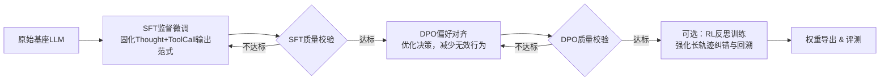

# 02 Agent模型训练 (Agent Model Training)

> Agent模型训练方法、SFT、RLHF、DPO、工具调用训练

**内容重点**: 训练技术，模型优化

---

## 1. 本章定位
本章聚焦**微调式Agent模型训练全链路**，讲解从基座大模型到Agent专用模型的整套训练范式。
对比SFT、DPO、RL(PPO)在Agent场景下的作用、边界、风险与准入条件，给出工业界标准训练流水线。
> [!NOTE]
> 本章只讲模型训练层面逻辑；数据流水线、硬件分布式、训练框架工程会在后续独立章节展开。

## 2. Agent模型训练核心目标
普通LLM训练目标：提升通用问答、创作、逻辑能力。
Agent模型训练目标分为三层，优先级从高到低：
1. ✅ **范式固化**：教会模型固定的思考‑工具调用输出格式，稳定输出合法结构化JSON；
2. ✅ **决策能力习得**：学会判断何时调用工具、选择正确工具、生成合理入参；
3. ✅ **偏好与反思对齐**：优化思考质量，减少无效调用、冗余步骤，学会基于观测结果纠错。

> [!IMPORTANT]
> 工程铁律：**范式固化是一切前提**。如果格式输出不稳定，决策、反思能力再强也无法落地。

## 3. Agent标准训练流水线总览

> 
> 流水线约束：禁止跳过SFT直接进入DPO/RL；RL属于高阶可选环节，很多生产Agent只做到DPO即可上线。

## 4. 三大训练范式深度解析（Agent场景）

### 4.1 SFT 监督微调 — Agent地基

**核心作用**：教会模型“应该怎么输出”，把ReAct/Reflexion的输出范式烙印进权重。

- 输入：高质量Agent轨迹样本 `thought + tool_call + observation`；
- 损失：标准因果LM损失，只对assistant侧输出做loss计算；
- 产出：模型能够稳定输出规定格式的思考块与工具调用JSON。

**SFT成功标志**

- 验证集工具调用JSON格式通过率 ≥90%；
- 理解工具使用场景，不会编造不存在工具；
- 可以输出完整thought推理，不会直接跳过思考输出动作。

**SFT典型失效现象**

1. loss持续下降，但推理大量输出非法JSON；👉 数据集格式错误、样本多样性不足；
2. 模板复制，完全照搬训练集文本；👉 epoch过高，发生过拟合；
3. 不会做新query泛化；👉 数据集覆盖场景不足。

> SFT不解决：思考冗余、频繁无效调用工具、参数不够精准这类偏好问题。

### 4.2 DPO 直接偏好优化 — 决策质量调优

**前置条件：必须使用经过合格SFT的权重**
**核心作用**：在不破坏输出范式前提下，优化Agent的决策偏好。

- 输入：成对偏好样本 `prompt + chosen(优质轨迹) / rejected(缺陷轨迹)`；
- 损失：DPO对比损失，学习区分好/坏的Agent行为；
- 产出：减少无效调用、精简冗余思考、提升工具参数精准度。

> 
> rejected样本不是完全乱码，是**有缺陷但格式合法的Agent轨迹**：例如思考啰嗦、参数缺失、重复调用工具。

**DPO成功标志**

- chosen样本奖励显著高于rejected；
- JSON格式通过率维持在88%以上，没有明显退化；
- 行为向chosen样本靠拢，减少缺陷行为。

**DPO典型失效现象**

1. JSON格式崩坏、大量解析报错；👉 学习率/beta过高、SFT基座不合格、rejected样本本身格式错误；
2. chosen/rejected奖励几乎无差别；👉 成对样本区分度不足；
3. 输出极度模板化，多样性丢失；👉 beta过大、epoch过高。

### 4.3 RL‑PPO 反思强化学习 — 高阶长轨迹优化（可选）

> 
> 成本高、稳定性差，**生产环境非必须**。多数落地Agent止步DPO即可。
> **核心作用**：基于完整轨迹的环境反馈做奖励，强化多步长任务、错误回溯、自我纠错能力。

- 输入：完整Agent执行轨迹 + 外部奖励函数打分；
- 损失：PPO策略梯度损失；
- 产出：长复杂任务的完成率提升，学会在工具返回错误时重试与修正。

**RL的固有风险**

1. 训练震荡，极易发生能力“遗忘”，破坏SFT习得的格式范式；
2. 奖励函数偏差会带来严重的reward‑hacking，模型投机讨好奖励，而非真正解决任务；
3. 算力开销远高于SFT、DPO。

> 
> 只有当你的业务大量存在多步骤复杂任务，DPO效果到达瓶颈，才考虑引入RL。

### 范式横向对比表

| 训练范式 | 核心目标 | 是否必须 | 算力开销 | 主要风险 | 前置依赖 |
| --- | --- | --- | --- | --- | --- |
| SFT监督微调 | 固化输出范式、学会工具调用格式 | ✅必选 | 中等 | 过拟合、数据集污染 | 基座模型 |
| DPO偏好对齐 | 优化决策偏好，减少无效行为 | ✅推荐 | 较高 | 格式范式退化 | 合格SFT权重 |
| RL‑PPO反思训练 | 长轨迹反思纠错，复杂任务提升 | ❌可选 | 很高 | 训练震荡、reward hacking、能力遗忘 | 合格DPO权重 |

## 5. Agent训练准入与退出校验标准

每一个阶段完成，必须做校验，不达标不能流入下一阶段。

### ✅ SFT阶段退出准入（进入DPO门槛）

1. 验证集loss收敛，无明显过拟合；
2. 工具调用JSON格式通过率 ≥ 90%；
3. 不会编造不存在工具；
4. 可以输出完整thought推理逻辑。

### ✅ DPO阶段退出准入（进入RL/上线门槛）

1. DPO loss收敛，`rewards/chosen > rewards/rejected`；
2. JSON格式通过率 ≥ 88%；允许小幅下降，不能断崖下跌；
3. 无效工具调用占比显著下降；
4. 没有出现两类极端退化：无脑调用工具 / 完全拒绝调用工具。

### ✅ RL阶段退出准入（高阶）

1. 长轨迹任务成功率显著提升；
2. 格式通过率维持 ≥85%；
3. 无严重reward‑hacking现象；
4. 基座通用能力没有大规模遗忘。

> 
> [!CAUTION]
> 格式通过率一旦大幅下跌，立刻回退上一阶段权重，不要强行继续训练。

## 6. LoRA / QLoRA vs 全参数训练选型

Agent模型训练绝大多数场景采用LoRA/QLoRA微调。

| 模式 | 适用场景 | 优点 | 缺点 |
| --- | --- | --- | --- |
| QLoRA‑4bit | 7B‑13B，单卡消费级GPU做Agent训练 | 显存开销低，普通4090即可开展训练 | 基座4bit量化会带来微小精度损失 |
| LoRA‑FP16/BF16 | 多卡服务器A100/H100，追求最高质量 | 无基座量化损失 | 显存消耗大，需要多卡算力 |
| 全参数训练 | 70B以上基座，大规模工业预训练，极少用于二次Agent微调 | 能力上限最高 | 算力成本极高，普通开发者不可企及 |

> 
> Agent二次微调，优先QLoRA‑4bit做原型验证；生产环境多卡条件下优先FP16 LoRA。

## 7. 训练推理一致性问题（高频工程大坑）

Agent训练出来的模型，线上推理经常效果暴跌，根源大多是**训练推理格式不一致**：

1. 训练时使用的prompt模板、thought标记、toolcall JSON schema，推理时被修改；
2. 训练集里面的角色分隔符、特殊标记，推理侧没有沿用；
3. 训练时做的预处理逻辑，推理侧缺失。

> 解决方案：把训练侧的prompt模板、标记封装成统一工具函数，训练、推理代码共用同一套逻辑，禁止两边分别手写。

## 8. 本章小结

1. Agent训练遵循固定链路：`基座 → SFT(必选) → DPO(推荐) → RL(可选高阶)`，严禁跳步。
2. SFT解决“会不会输出正确格式”；DPO解决“行为好不好”；RL解决“复杂长轨迹纠错”。
3. 每个阶段都要有硬性退出校验指标，**格式通过率优先级高于loss指标**。
4. 训练‑推理范式对齐是保障线上效果的关键。

下一篇：**03‑Agent‑Data‑Pipeline‑Agent.md**，讲解Agent全链路数据流水线：数据源、合成、清洗、校验、版本管理、数据集坑点。
