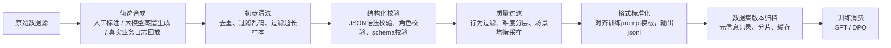

# 03 Agent数据管线 (Agent Data Pipeline)

> 数据采集、合成、清洗、标注、质量评估

**内容重点**: 数据工程，数据质量

---


## 1. 本章定位
数据是Agent能力的决定性瓶颈。Agent数据集和普通对话数据集存在巨大差异：普通对话关注问答流畅度，Agent数据集需要完整保留**思考、工具调用、工具观测、反思**的完整轨迹。

本章完整覆盖Agent数据工程全链路：数据源、轨迹合成、清洗校验、过滤采样、格式标准化、版本管理、数据集坑点。
> [!NOTE]
> 本流水线产出物直接供给上一章 `02‑Agent‑Model‑Training‑Agent` 的SFT、DPO训练环节。

## 2. Agent数据集核心诉求
Agent训练数据集，不能只看样本数量，重点看**轨迹质量、多样性、格式合规性**。

核心诉求：
1. 轨迹完整性：单条样本尽量保留完整闭环：`用户输入 → thought → tool_call → observation → reflect`
2. 格式强约束：thought、toolcall JSON必须语法合法，不能存在语法错误、转义异常
3. 行为多样性：覆盖成功、部分失败、需要重试、直接拒绝调用等多种case
4. 难度分层：简单单工具调用、多步骤规划、边界异常场景合理配比
5. 任务分布均衡：避免某一类工具、某一类query占比过高，防止模型过拟合模板

> [!IMPORTANT]
> 工程铁律：**坏样本对Agent训练伤害远大于缺少样本**。少量高质量轨迹 >> 百万级低质量脏数据。

## 3. Agent数据流水线总流程



## 4. 三大数据源对比

| 数据源 | 说明 | 优点 | 缺点 | 适合场景 |
| --- | --- | --- | --- | --- |
| 人工标注轨迹 | 人工编写完整ReAct轨迹，包含thought+tool_call+observation | 质量最高，格式可控 | 成本昂贵，产出慢 | 核心高价值小样本，种子数据集 |
| 大模型蒸馏合成 | 使用强基座(大尺寸LLM)生成Agent轨迹 | 产出量大，成本可控 | 存在模板化、幻觉、格式错误风险 | 扩充数据集主体，绝大多数项目主力数据源 |
| 业务日志回放 | 线上Prompt‑Agent真实会话日志，做清洗过滤 | 贴合真实用户分布，业务贴合度高 | 脏数据极多，大量无效循环、错误输出 | 业务垂直Agent迭代，二次迭代数据集 |

> 
> 行业通用方案：**少量人工种子样本 + 大量大模型蒸馏扩充 + 业务日志补充**。

### 4.1 种子数据集构建建议

种子集规模不需要巨大：单工具域，**几百~一千条高质量人工轨迹**就可以作为种子，用来引导大模型蒸馏生成更多样本。
种子集必须覆盖：

- 正常调用工具成功case
- 参数缺失、参数错误的边界case
- 不需要调用工具，直接回答用户的case
- 工具调用失败，需要重试、换参数的case

## 5. 轨迹合成关键工程要点

### 5.1 大模型蒸馏生成轨迹

生成Prompt必须强制约束输出结构：

1. 强制输出thought推理块，禁止跳过思考直接输出toolcall；
2. toolcall必须输出标准JSON，禁止markdown代码块以外的乱格式；
3. 必须模拟真实observation返回，包含成功、报错、空结果等多种返回；
4. 强制模拟失败场景：工具报错、参数无效，产生反思重试的轨迹。

> 
> 常见坑：生成的轨迹全部是“一帆风顺全部成功”，缺少失败重试样本。训练出来的Agent遇到工具报错完全不会处理。

### 5.2 业务日志回放处理

业务日志不能直接拿来训练，必须过滤：

1. 过滤无限循环、重复调用同一个工具的坏会话；
2. 过滤框架强制修正后的输出，只保留模型原生输出；
3. 过滤人工干预后的会话；
4. 把日志会话对齐统一角色、模板格式。

> 
> 日志回放最大风险：把线上Agent的错误行为全部喂给模型，把错误固化进权重。

## 6. 清洗与结构化校验（必须脚本自动化执行，不要人工肉眼全量检查）

### 6.1 基础清洗步骤

1. 去重：基于query语义去重，避免高度相似query泛滥；
2. 长度过滤：过滤token过长/过短的异常样本；
3. 乱码过滤：过滤特殊不可见字符、乱码、大量重复文本。

### 6.2 Agent专属结构化校验项

每一条轨迹必须全部通过校验，否则直接丢弃：

1. 角色校验：`user / assistant`角色顺序合法，角色不能错乱；
2. JSON语法校验：toolcall JSON可正常json.loads，无语法错误、逗号错误、转义错误；
3. schema校验：校验`tool_name`、`arguments`字段存在，参数类型匹配工具schema；
4. thought校验：assistant输出必须包含推理思考片段，不允许直接裸输出JSON；
5. observation校验：工具返回观测内容不能为空（对应多轮轨迹）。

> 
> [!WARNING]
> 如果把JSON语法非法的样本送入SFT训练：loss看起来下降，但是模型会学习输出非法JSON，推理完全不可用。

## 7. 质量过滤与分层采样

校验通过之后，还需要做质量过滤与均衡采样，避免数据集分布倾斜。

### 样本标签体系

每条样本建议打上标签，用于采样控制：

- `sample_type`: `tool_single` / `tool_multi_step` / `no_tool_answer` / `retry_reflect`
- `difficulty`: `easy` / `medium` / `hard`
- `tool_list`: 使用到的工具名称列表

### 配比参考（SFT数据集）

| 样本类型 | 占比参考 |
| --- | --- |
| 单工具简单调用 | 40% |
| 多步骤复杂任务 | 30% |
| 无需调用工具，直接回答 | 15% |
| 失败‑重试‑反思纠错轨迹 | 15% |

> 
> 不要全部都是简单成功调用，一定要保留15%左右重试失败类样本，提升Agent鲁棒性。

### DPO数据集特殊要求

DPO数据集是成对样本 `prompt + chosen / rejected`：

1. chosen、rejected**两者格式都必须合法JSON**；
2. rejected是行为缺陷，不是彻底乱码；例如思考冗余、参数不全，而不是语法报错；
3. 成对样本要有明确区分度，不能只是措辞微小差异；
4. 控制正负样本对多样性，避免同一query大量重复。

## 8. 格式标准化

经过过滤后的样本，统一映射到训练使用的message模板。

> 
> 核心原则：**数据流水线输出的message格式，必须和训练时tokenizer输入模板完全对齐，推理侧也要复用同一套模板**。

SFT单条jsonl示例：

```
{
  "messages": [
    {"role":"user","content":"查询杭州明天天气"},
    {"role":"assistant","content":"需要获取杭州明日天气，调用天气工具\n{\"tool_name\":\"get_weather\",\"arguments\":{\"city\":\"杭州\",\"date\":\"tomorrow\"}}"}
  ],
  "sample_type":"tool_single",
  "difficulty":"medium"
}
```

DPO单条jsonl示例：

```
{
  "prompt":[{"role":"user","content":"查询杭州明天天气"}],
  "chosen":[{"role":"assistant","content":"需要获取杭州明日天气，调用天气工具\n{\"tool_name\":\"get_weather\",\"arguments\":{\"city\":\"杭州\",\"date\":\"tomorrow\"}}"}],
  "rejected":[{"role":"assistant","content":"我想想，查天气，调用工具\n{\"tool_name\":\"get_weather\",\"arguments\":{}}"}],
  "sample_type":"dpo_tool_param_defect",
  "difficulty":"medium"
}
```

输出产物：标准jsonl文件，分为train.jsonl / val.jsonl，验证集占比建议 5%‑10%，验证集不能和训练集query重复。

## 9. 数据集版本管理

Agent数据集需要强版本管理，方便复现实验。
建议每个数据集版本保存：

1. 数据集id、版本号、生成时间；
2. 数据源来源统计：人工多少条、蒸馏多少条、日志回放多少条；
3. 样本统计：各sample_type、difficulty数量统计；
4. 校验脚本版本、过滤规则；
5. train/val拆分索引；
6. md5校验，文件备份。

> 
> 实验复现最大坑：改了数据集但是没有版本记录，后续无法复现训练结果。

## 10. 高频数据集坑点总结

1. ❌ 全部样本都是成功调用，缺少失败重试样本 → Agent遇到工具报错直接崩溃；
2. ❌ 大量JSON语法错误样本流入训练集 → loss好看，推理输出大量非法JSON；
3. ❌ 数据集全部是单步任务，缺少多步骤轨迹 → 复杂任务规划能力差；
4. ❌ 训练集和推理模板不一致 → 线上效果断崖下跌；
5. ❌ DPO的rejected样本是乱码JSON → DPO训练破坏原有SFT范式；
6. ❌ 某一类工具样本占比极高 → 模型过拟合，无脑调用该工具。

## 11. 本章小结

1. Agent数据集核心不是样本数量，而是轨迹完整性、格式合规、场景多样性。
2. 推荐数据源组合：少量人工种子集 + LLM蒸馏扩充 + 业务日志补充。
3. 必须自动化做JSON、角色、schema校验，脏样本危害巨大。
4. SFT、DPO对数据集格式要求不同，DPO成对样本有特殊约束。
5. 数据集版本管理是实验可复现的基础；训练、推理、数据流水线三者模板必须统一。

下一篇：**04‑Agent‑Infrastructure‑Agent.md**，讲解Agent基础设施：单多卡分布式、存储缓存、MCP/LangGraph、训练推理一致性工程。
