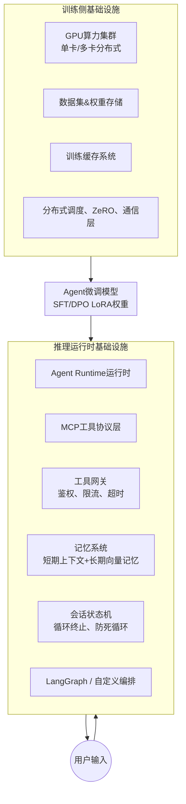

# 04 Agent基础设施 (Agent Infrastructure)

> 部署、推理、服务化、监控、弹性伸缩

**内容重点**: 工程架构，基础设施

---

## 1. 本章定位
本章讲解Agent全栈基础设施，覆盖**训练侧基础设施**与**推理运行时基础设施**。
很多Agent项目只关注模型、数据集，忽略底层基础设施，最终出现：分布式训练异常、显存OOM、训练‑推理割裂、会话状态丢失、工具调用不稳定等线上问题。

> [!NOTE]
> 基础设施分为两大块：模型训练基础设施（GPU集群、分布式、存储缓存）；Agent运行时基础设施（MCP、LangGraph、记忆、状态管理、工具网关）。

## 2. Agent基础设施全景总览

## 3. 训练侧基础设施

### 3.1 算力硬件选型

Agent训练分为原型验证与生产训练两套场景。

| 场景 | 硬件配置 | 推荐方案 | 备注 |
| --- | --- | --- | --- |
| 原型验证7B‑13B | 单消费级GPU | RTX4090 / A10 24G | QLoRA‑4bit，可完成SFT/DPO原型；不支持大规模RL‑PPO |
| 小规模生产13B‑34B | 多卡服务器 | A100 / H100 40G‑80G | FP16 LoRA，ZeRO‑2/ZeRO‑3；DPO/PPO均可运行 |
| 大规模70B+Agent训练 | 多机多卡集群 | H100集群 | 全参数/大LoRA训练，成本高，普通团队极少使用 |

> 
> [!IMPORTANT]
> Agent DPO训练显存压力显著高于SFT，双分支同时计算，同等条件下显存占用接近SFT的2倍。

### 3.2 分布式训练配置约束

Agent训练主要依赖 Hugging Face Accelerate + DeepSpeed。

- SFT、DPO：**优先使用 ZeRO‑Stage2**；
- DPO强烈不推荐 ZeRO‑Stage3，极易出现loss NaN、双分支计算异常；
- PPO‑RL场景，在显存压力极大时可谨慎开启ZeRO‑3，需要额外做梯度裁剪、稳定性调优。

> 
> 常见踩坑：直接复制通用LLM训练的ZeRO‑3配置给DPO，训练直接报废。

### 3.3 存储与缓存

1. **数据集存储**：优先本地高速SSD或者分布式对象存储；jsonl数据集建议做预处理缓存，避免训练时重复做tokenize；
2. **权重存储**：基座原始权重、LoRA中间checkpoint、最终导出权重，做好版本标记；checkpoint按需保存，避免磁盘占满；
3. **缓存策略**：tokenizer输出、数据集预处理结果持久化缓存，大幅减少重复实验耗时。

### 3.4 训练侧工程约束

1. 训练环境必须固定依赖版本：transformers、trl、peft、accelerate、deepspeed，版本漂移会直接改变训练行为；
2. 训练环境与推理环境的transformers、tokenizer版本尽量保持一致，降低tokenizer行为差异带来的训练‑推理gap。

## 4. Agent推理运行时基础设施

> 
> 模型权重只是“大脑”，真正让Agent跑起来的是这套运行时基础设施。即使模型微调质量很高，如果运行时设计缺陷，Agent依然会表现很差。

### 4.1 Agent Runtime核心组件

1. **模型接入层**：统一封装模型调用，兼容本地部署、vLLM/TGI推理服务，屏蔽底层模型差异；**强制复用训练时完全一致的prompt模板、特殊标记、tokenizer**。
2. **MCP工具协议层**：Model Context Protocol，标准化工具描述、入参schema、调用返回格式。统一协议之后，工具可以热插拔，不需要修改模型训练逻辑。
3. **Tool Gateway工具网关**
   - 工具鉴权、权限控制；
   - 请求超时、重试策略、熔断；
   - 参数校验，防止模型输出非法参数直接透传给业务接口；
   - 调用日志埋点，统计工具调用成功率、失败类型。
4. **会话状态机 State Machine**
   - 维护单轮会话完整状态：历史上下文、已执行工具、任务进度；
   - **防无限循环**：设置最大迭代轮次，超过阈值强制终止Agent循环，避免死循环消耗资源。
5. **Memory记忆子系统**
   - 短期记忆：会话上下文窗口，直接送入LLM；
   - 长期记忆：向量数据库，做跨会话知识召回；> 
   > 注意：记忆检索是框架侧能力，不是模型原生能力，不要期待微调模型自动具备长期记忆。
6. **编排框架层**：LangGraph / 自研状态编排，实现ReAct、Reflexion的循环逻辑。

### 4.2 MCP协议价值

MCP把工具描述、参数schema、返回格式标准化。

- 训练阶段：数据集内工具定义必须和MCP schema对齐；
- 推理阶段：网关直接读取MCP schema，完成参数校验；> 
> 工程大坑：训练时工具schema和线上MCP schema不一致，模型训练学会的参数规范线上不生效。

## 5. 训练‑推理一致性（本章节最高优先级）

绝大多数微调Agent上线效果暴跌，根源都在这里。

需要严格对齐的维度清单：

1. ✅ Tokenizer版本、特殊token、pad/eos标记；
2. ✅ Prompt模板、角色分隔符、thought标记、toolcall输出格式；
3. ✅ 工具schema定义，工具名称、入参字段；
4. ✅ observation工具返回的格式，传给模型的文本包装格式；
5. ✅ 最大上下文长度，截断策略。

> 
> 最佳工程实践：**抽取公共模板工具库，训练脚本、数据流水线、推理服务三方共用同一套代码，禁止三方分别手写模板字符串**。

不一致带来现象：

- 模型输出乱码、toolcall JSON解析失败；
- thought推理缺失，直接裸输出JSON；
- 工具参数字段错乱，调用工具全部报错。

## 6. 两种部署架构对比：微调Agent的上线方案

| 架构模式 | 描述 | 优势 | 劣势 | 适用场景 |
| --- | --- | --- | --- | --- |
| 模式A：微调模型 + 轻量编排框架 | 模型内化Thought+ToolCall范式；框架只做工具调用、状态循环、记忆；不做复杂prompt改写 | 逻辑简单，故障点少；充分发挥微调收益 | 复杂业务逻辑需要模型能力支撑 | 绝大多数生产微调Agent |
| 模式B：微调模型 + 重度上层编排 | 微调基座，上层LangGraph做大量路由、prompt改写、分支判断 | 业务灵活性高，可以弥补模型缺陷 | 系统链路复杂，训练推理对齐难度提升 | 业务极度复杂、多智能体场景 |

> 
> 不建议：微调完Agent，推理侧又套一层强Prompt去重写模型输出，会抵消微调带来的收益。

## 7. 可观测性基础设施

Agent系统必须完整埋点，方便定位问题：

1. 训练侧：记录每一轮checkpoint、loss曲线、验证集指标、格式通过率；
2. 推理侧埋点：
   - 用户query、每一轮thought、tool_call入参；
   - 工具返回observation、是否触发重试；
   - 会话终止原因：任务完成 / 达到最大轮次 / 异常报错；
   - JSON解析失败计数、工具调用失败统计。

> 
> 没有埋点，线上Agent出问题完全无法区分：是模型权重问题？数据集问题？还是运行时代码bug。

## 8. 高频基础设施踩坑清单

1. ❌ DPO训练直接套用ZeRO‑3配置，出现loss NaN；👉 DPO固定ZeRO‑2；
2. ❌ 训练、推理两套独立prompt模板；👉 抽取公共组件三方复用；
3. ❌ 数据集工具schema和线上MCP工具schema不一致；👉 schema统一维护；
4. ❌ Agent运行时没有最大迭代轮次限制，出现无限循环消耗算力；👉 状态机增加最大轮次强制终止；
5. ❌ 记忆向量库检索结果直接粗暴塞进上下文，不做格式对齐；👉 记忆召回结果按照训练时格式包装；
6. ❌ 推理环境transformers版本和训练环境差异过大，tokenizer行为改变；👉 锁定依赖版本。

## 9. 本章小结

1. Agent基础设施分为训练侧基础设施与推理运行时基础设施，两者同等重要。
2. DPO分布式优先ZeRO‑2，谨慎使用ZeRO‑3。
3. MCP标准化工具协议，训练数据集schema与线上运行时schema必须对齐。
4. 训练‑推理一致性是基础设施层面第一铁律，公共模板代码三方共用。
5. Agent运行时必须具备状态机、最大迭代限制、完整埋点可观测能力。

下一篇：**05‑Harness‑Engineering.md**，讲解训练工程脚手架：TRL、PEFT、Accelerate、自定义训练harness、断点续训、实验管理、训练流水线封装。

