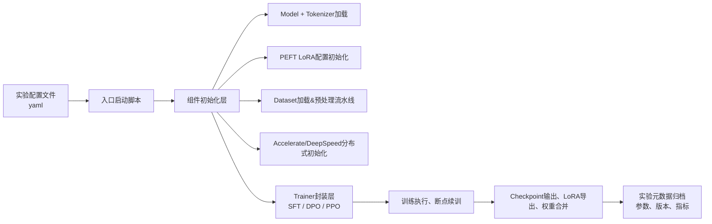

# 05 Harness工程 (Harness Engineering)

> 工具调用框架、MCP协议、A2A协议、API集成

**内容重点**: 协议标准，工具生态

---

## 1. 本章定位
Harness（训练脚手架/训练工程）指围绕模型训练的整套工程代码、封装、实验管理、执行链路。
很多Agent项目算法逻辑没问题，但脚手架粗糙，带来：版本混乱、断点续训失效、复现失败、数据集加载bug、参数漂移、训练与推理代码割裂。
本章聚焦工业界Agent训练脚手架工程实践，基于 Hugging Face 技术栈：`PEFT / TRL / Accelerate / Transformers`。

> [!NOTE]
> 本章不讲解底层算法公式，聚焦工程实现：如何把数据集、模型、分布式组件组装成稳定可复现的训练流水线。

## 2. Harness整体架构总览



## 3. 核心依赖栈版本约束

Agent训练对库版本非常敏感，版本升级会直接改变训练行为，甚至造成DPO loss NaN、样本预处理异常。

推荐锁定核心依赖（原型与生产环境统一）：

- `transformers`：锁定固定release版本
- `peft`：LoRA/QLoRA实现，DPO/SFT高度依赖
- `trl`：DPOTrainer、SFTTrainer、PPOTrainer，Agent训练核心
- `accelerate`：分布式抽象层
- `datasets`：数据集加载、预处理
- `deepspeed`：ZeRO分布式后端
- `bitsandbytes`：4‑bit QLoRA量化

> 
> [!IMPORTANT]
> 最佳实践：使用`requirements.txt` / `pyproject.toml`锁定完整版本，使用conda或者docker固化环境，禁止直接滚动安装最新版。
> 训练环境与推理环境尽量保持transformers、peft版本一致，降低tokenizer、LoRA加载行为差异。

## 4. 配置管理工程

不要把超参写死在python代码中，全部抽离配置文件(yaml)。
配置文件分为四大块：

1. **模型配置**：基座路径、量化设置、LoRA参数(r、alpha、target_modules、dropout)
2. **数据集配置**：train/val文件路径、验证集占比、prompt模板id、最大序列长度
3. **训练超参**：lr、epoch、batch、gradient_accumulation、beta(DPO)、梯度裁剪
4. **分布式配置**：accelerate/deepspeed参数、ZeRO阶段

> 
> Agent专属约束：LoRA配置在SFT、DPO阶段**必须完全一致**，DPO不可随意修改r、alpha、target_modules。

示例极简配置片段：

```
model:
  base_model_path: "./base‑llm"
  load_in_4bit: true
lora:
  r: 16
  lora_alpha: 32
  target_modules: ["q_proj","v_proj","k_proj","o_proj","gate_proj","up_proj","down_proj"]
training:
  learning_rate: 5e‑5
  num_train_epochs: 2
  per_device_train_batch_size: 1
  gradient_accumulation_steps: 16
dpo:
  beta: 0.2
```

## 5. 数据集预处理模块（脚手架最容易出bug的地方）

### 5.1 预处理逻辑必须独立封装

把prompt模板、消息拼接、token逻辑封装成独立函数，**训练、数据校验脚本、推理服务三方复用该函数**，杜绝复制粘贴模板字符串。

常见错误：

- 训练脚本写一套模板，推理代码手写另一套模板，造成训练‑推理不一致；
- 在trainer内部lambda写预处理逻辑，无法外部复用做校验。

### 5.2 预处理需要做的工作

1. 根据配置的模板id拼接messages；
2. 执行tokenizer，处理padding、truncation；
3. SFT场景：mask loss，只对assistant输出计算loss；
4. DPO场景：分别处理prompt/chosen/rejected，控制max_prompt_length、max_target_length；
5. 返回符合SFTTrainer / DPOTrainer要求的字段。

> 
> 调试技巧：预处理模块单独写单元测试，输入一条样例，打印出token之后的文本，校验分隔符、特殊标记是否完全符合预期。

## 6. Trainer层选型与封装

### 6.1 SFTTrainer（SFT阶段）

- 使用场景：Agent轨迹SFT训练；
- 关键点：`response_template`正确配置；只对assistant部分计算loss；
- Agent场景注意：不要开启`packing`，Agent轨迹样本长度差异大，packing容易破坏对话边界。

### 6.2 DPOTrainer（DPO阶段）

Agent场景高频坑点：

1. `ref_model=None` 在peft LoRA模式下自动复用SFT基座，节省显存，优先使用；
2. 严格控制 `max_prompt_length`、`max_target_length`，防止双分支序列超长触发越界；
3. DPO不建议开启gradient checkpointing以外的复杂优化；
4. 分布式后端固定ZeRO‑2，不要直接套用通用大模型ZeRO‑3配置。

### 6.3 PPOTrainer（RL高阶）

PPO脚手架复杂度显著上升，普通Agent项目不建议优先使用。

- 需要额外配置reward计算逻辑；
- 需要处理模型推理采样、奖励打分、策略更新循环；
- 必须做好梯度裁剪，防止训练震荡。

> 
> 很多开源示例PPO代码缺少对Agent长轨迹的适配，直接复用极易出现训练崩坏。

## 7. Checkpoint与断点续训

### 7.1 checkpoint保存策略

1. 按epoch保存，或者按固定save_steps；Agent训练不建议保存过于频繁，磁盘占用巨大；
2. 每一个checkpoint必须附带完整的训练配置yaml，方便复现；
3. 区分：中间训练checkpoint、最终产出LoRA权重。

### 7.2 断点续训注意事项

1. 使用`trainer.train(resume_from_checkpoint=xxx)`；
2. 续训时，模型、LoRA配置、数据集、tokenizer必须和中断前保持一致；
3. DPO断点续训坑：部分版本trl下，resume时需要保证ref_model加载逻辑不变；
4. 续训不要随意修改学习率、epoch等关键超参。

> 
> 风险：直接修改代码后再resume，会导致训练行为不可预测。

## 8. 权重导出与合并工程

训练结束后脚手架需要支持3种输出：

1. **原始LoRA适配器**：体积小，推理时与基座合并加载；迭代实验首选，方便快速切换版本；
2. **合并完整权重**：把LoRA合并进基座模型，输出完整model，方便部署到不支持peft的推理服务(vLLM/TGI)；> 
> ⚠️ 4bit QLoRA训练后合并，需要先回退到fp16，会消耗大量显存；
3. **量化输出**：合并之后再做GPTQ/AWQ量化，用于线上低显存推理。

> 
> 工程建议：实验阶段保留LoRA适配器；上线部署再执行合并。不要用合并后的权重做下一轮继续训练。

## 9. 实验元数据与可复现性

每一次训练运行，脚手架自动归档如下信息：

1. 完整训练配置yaml副本；
2. git commit hash（代码版本）；
3. 数据集版本id、train/val拆分信息；
4. 依赖包版本清单；
5. 训练日志、loss曲线、验证集指标（JSON格式）；
6. 随机种子（必须固定seed，保证可复现）。

> 
> 复现失败的头号原因：没有记录git版本、数据集版本、随机种子，只保存模型权重。

## 10. 脚手架高频坑清单

1. ❌ prompt模板写在lambda内部，无法被推理侧复用 → 抽离公共预处理函数，单元测试覆盖；
2. ❌ DPO直接套用ZeRO‑3配置，loss出现NaN → Agent‑DPO固定ZeRO‑2；
3. ❌ SFT开启packing，破坏对话边界 → Agent训练关闭packing；
4. ❌ 续训过程修改LoRA参数、数据集 → 续训不能改动核心配置；
5. ❌ QLoRA训练完成直接保存4bit合并权重，推理异常 → 合并前恢复fp16；
6. ❌ 不固定随机seed，两次训练结果差异巨大 → 全局设置seed；
7. ❌ 只保存权重，不保存实验元数据 → 每次运行自动归档配置与版本。

## 11. 本章小结

1. Harness脚手架核心目标：**稳定、可复现、训练‑推理代码复用**。
2. 所有超参、模板抽离配置文件，禁止硬编码；预处理函数必须可外部复用。
3. SFT关闭packing；DPO优先ZeRO‑2；RL‑PPO复杂度高，非必需。
4. checkpoint、权重合并、实验元数据归档是工程不可缺少的环节。
5. 脚手架的bug，经常会伪装成模型/数据集问题，调试优先验证预处理输出。

下一篇：**06‑Capability‑Engineering.md**，讲解Agent能力工程：工具调用、规划、反思纠错、多智能体、能力退化治理。

