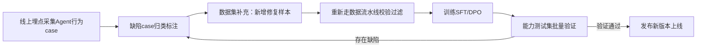

# 06 Agent能力工程 (Capability Engineering)

> 规划、记忆、工具使用、自我反思、多Agent协作

**内容重点**: 能力建设，能力增强

---

## 1. 本章定位
Capability‑Engineering（能力工程）聚焦：在模型训练完成之后，如何系统性打磨、修复、调优Agent各项业务能力，治理能力退化、缺陷行为。
前面章节讲数据集、训练、基础设施；本章面向**能力本身**：工具调用、任务规划、反思纠错、记忆、多智能体，以及常见的能力退化现象的定位与修复手段。

> [!NOTE]
> 很多团队陷入误区：训练完模型就认为能力已经交付。真实工程中，Agent能力是持续迭代打磨的闭环，不是训练一次就结束。

## 2. Agent能力回顾与能力退化总述
沿用01‑Core‑Concepts定义的六层能力分层：
1. **L1 格式能力**：稳定输出语法合法的工具调用JSON
2. **L2 工具决策能力**：判断调用时机、选对工具、输出合理参数
3. **L3 规划拆解能力**：复杂任务拆分成有序子步骤
4. **L4 反思纠错能力**：识别失败、重试、修正参数、放弃无效路径
5. **L5 长上下文与记忆能力**：长会话、跨会话知识复用
6. **L6 多智能体协作能力**：多角色分工协同完成复杂任务

> [!IMPORTANT]
> 能力是向下依赖的：上层能力失效优先排查下层能力是否损坏。
> 例如：反思经常失效，先确认L1格式、L2工具决策是否正常，不要直接去调优反思相关样本。

**什么是Agent能力退化**
经过训练/版本迭代之后，出现能力回退：JSON解析失败变多、乱调用工具、不会规划、不会反思。
退化来源分为三类：
1. 训练侧退化：数据集污染、训练超参不合理、遗忘旧能力；
2. 工程侧退化：训练‑推理格式不一致、schema变更、tokenizer版本变更；
3. 分布偏移：线上用户query、工具返回分布，和训练数据集差异过大。

## 3. L1‑格式能力工程（一切基础）
L1不达标，上层所有能力全部无效。

### 典型缺陷行为
- JSON语法报错：逗号缺失、引号转义错误、字段缺失
- 跳过Thought，直接裸输出toolcall JSON
- 在toolcall内部混入大量无关自然语言文本
- 输出markdown ```json```代码块包裹不稳定，时而有、时而没有

### 修复手段
1. **数据集侧**：增加大量边界case样本；严格过滤训练集中JSON非法样本；增加“禁止混入无关文本”的样本；
2. **训练侧**：SFT阶段不要设置过大epoch，防止过拟合/范式遗忘；DPO阶段监控格式通过率指标，一旦断崖下跌立刻回退权重；
3. **推理运行时兜底**：网关层增加JSON解析容错，**兜底只是防护手段，不能替代模型本身格式能力修复**；
> 警告：不要依赖框架层做正则修复、字符串清洗来“修补”模型输出，会掩盖模型本身缺陷。

### 验证方法
批量跑测试集，统计**JSON格式通过率**，作为版本发布的门禁指标。

## 4. L2‑工具决策能力工程
核心：模型正确判断「要不要调用工具、调用哪个工具、填什么参数」。

### 典型缺陷行为
1. 过度调用：不需要工具也强行调用工具；
2. 拒绝调用：明明需要工具，直接编造答案，不执行调用；
3. 工具选择错误：选错tool_name；
4. 参数缺陷：参数为空、参数类型错误、参数语义不合理。

### 修复手段
1. 数据集增加三类样本：
    - 无需调用工具，直接回答的case；
    - 多工具候选，需要做选择的case；
    - 参数边界case：参数缺失、参数非法、模糊输入；
2. DPO成对样本针对性构造：chosen为正确决策，rejected为过度调用/拒绝调用的合法轨迹；
3. 检查工具schema是否过于复杂，schema字段过多会加剧模型参数输出错误；
4. 线上统计工具调用行为分布：统计过度调用占比、拒绝调用占比、参数错误占比，反向指导数据集迭代。

> 常见坑：训练集全部是“需要调用工具”的样本，缺少“直接回答”样本，上线后出现高频过度调用。

## 5. L3‑规划拆解能力工程
规划能力：把复杂用户目标拆解为有序、可执行的子任务序列。

### 典型缺陷行为
1. 一步输出全部子任务，不会分步执行；
2. 子任务顺序错乱，依赖前置条件未完成就执行后续步骤；
3. 任务拆解不全，遗漏必要子步骤。

### 修复手段
1. 数据集增加多步骤长轨迹样本，轨迹必须是分步执行，每一步对应一次toolcall；
2. 样本中显式体现thought内部的拆解逻辑，让模型学会在思考环节做任务分解；
3. 难度循序渐进：2步任务 →3‑4步任务，逐步增加复杂度；
4. 评估：统计多步骤任务完成率，而不是只看单步工具调用成功率。

> 注意：规划能力强依赖基座本身推理能力，如果基座本身逻辑弱，仅靠少量样本很难得到强规划Agent。

## 6. L4‑反思纠错能力工程
反思：基于工具返回观测结果，判断成功/失败，决定重试、修改参数、更换工具、放弃任务。

### 典型缺陷行为
1. 工具返回报错，Agent直接把错误返回给用户，不做任何重试；
2. 无限重试同一套错误参数；
3. 无法识别空结果、无效返回，继续向下执行；
4. 不会判断信息不足，强行编造答案。

### 修复手段
1. 数据集必须包含大量失败轨迹：工具报错、返回空、参数无效，完整包含`观测‑反思‑修正‑重试`完整闭环；
2. thought内部显式写出反思判断逻辑：“工具返回XX错误，原因是XX，我需要修改XX参数重新调用”；
3. DPO加入反思行为的偏好样本；
4. 运行时状态机设置最大迭代轮次，兜底防止无限重试。

> 高频误区：只喂成功样本，期望模型自动学会反思纠错。反思能力无法单纯从成功样本中习得。

## 7. L5‑长上下文与记忆能力工程
> 重要区分：
> - 上下文窗口内短期记忆：模型原生能力，可以通过微调强化；
> - 长期向量记忆：**框架运行时能力，不属于模型权重能力**，不能指望微调模型自动学会跨会话记忆。

### 典型缺陷行为
1. 多轮会话遗忘早期用户约束条件；
2. 长轨迹下丢失前面工具调用的上下文信息。

### 修复手段
1. 训练集增加长会话轨迹样本；
2. 推理侧控制上下文截断策略，优先保留关键约束信息；
3. 向量记忆检索结果，必须按照训练时的格式包装后送入上下文，不能直接原始拼接。

## 8. L6‑多智能体能力工程
Multi‑Agent是上层编排架构，分为两种模式：
1. 同一模型，不同system prompt扮演不同角色；
2. 多个不同专长Agent模型互相调用。

> 注意：不要混淆：多智能体主要是框架层编排，**不是一定要训练一套专门的多智能体权重**。

### 典型缺陷行为
- 角色混淆，输出偏离当前角色职责；
- Agent之间消息传递格式错乱。

### 修复手段
1. 如果需要微调做多智能体：训练样本中严格区分角色system prompt，角色边界清晰；
2. 框架层做消息路由、消息格式校验，做上层兜底。

## 9. Agent能力退化定位排查流程
当线上Agent能力变差，按下面顺序定位根因，不要直接盲目加训练样本：

1. 第一步：确认**训练‑推理一致性**
    - prompt模板、tool schema、tokenizer、特殊标记是否完全对齐；
    - 版本变更：transformers、peft版本是否发生改动。
2. 第二步：定位是模型权重问题，还是运行时代码问题
    - 使用完全相同输入，离线跑模型推理；对比线上运行时输出。离线复现缺陷=权重问题；线上才出现=运行时代码bug。
3. 第三步：分层定位哪一层能力损坏
    - L1格式是否正常？如果格式崩坏，上层能力全部失效。
4. 第四步：数据集与训练侧排查
    - 是否新增了脏样本；epoch是否过大发生过拟合；DPO beta、学习率是否过高；
5. 第五步：分布偏移排查
    - 线上query、工具返回结果是否大量出现在训练集覆盖范围之外。

## 10. 能力迭代闭环工作流


> Agent不是训完就结束，是线上case回流、数据集迭代、训练、验证、上线的持续闭环。

## 11. 本章小结
1. Agent能力分层向下依赖，上层能力异常优先排查下层基础能力；
2. L1格式能力是基石，不能依赖框架兜底修复模型输出；
3. 反思纠错能力必须依靠失败‑重试轨迹样本，只靠成功样本无法习得；
4. 长期向量记忆属于框架能力，不是模型微调可以直接获得；
5. 能力退化排查遵循：推理一致性 → 离线复现区分权重/代码问题 → 分层定位能力层级 → 数据集&训练排查；
6. Agent能力是持续迭代闭环，线上真实case回流是迭代的重要来源。

下一篇：**07‑Knowledge‑Distillation.md**，讲解Agent知识蒸馏：轨迹蒸馏、小Agent对齐大Agent、蒸馏数据集构造、蒸馏避坑。
