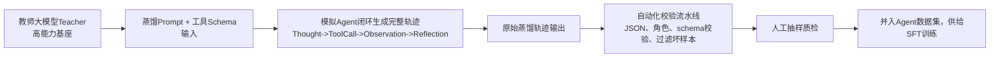

# 07 知识蒸馏 (Knowledge Distillation)

> 教师模型蒸馏、能力迁移、模型压缩、效率优化

**内容重点**: 蒸馏技术，模型优化

---

## 1. 本章定位
Agent知识蒸馏是用**强大模型（Teacher教师）生成高质量Agent轨迹，用来训练小尺寸Agent模型（Student学生）**。
在Agent工程中，蒸馏是数据集构建最核心手段之一：解决人工标注成本高、样本数量不足的痛点。
> [!NOTE]
> Agent蒸馏和普通LLM对话蒸馏不一样：普通蒸馏侧重问答文本；Agent蒸馏重点蒸馏完整闭环轨迹：Thought → ToolCall → Observation → Reflection。

本章覆盖：蒸馏范式、轨迹蒸馏Prompt设计、数据集构造、教师模型选型、蒸馏常见缺陷、蒸馏质量校验、避坑清单。

## 2. Agent蒸馏两大范式
|范式|说明|适用场景|
|---|---|---|
|轨迹蒸馏（Trace Distillation）|教师模型模拟完整Agent执行闭环，输出完整ReAct/Reflexion轨迹，产出SFT训练样本；学生模型SFT学习该轨迹|绝大多数Agent项目，构建SFT种子/扩充数据集|
|偏好蒸馏（Preference Distillation）|教师产出成对chosen/rejected样本，构造DPO偏好数据集|扩充DPO训练集，成本更高，对教师质量要求高|

> 工业界主流：优先**轨迹蒸馏做SFT数据集**；DPO数据集优先人工筛选+少量蒸馏偏好对，不建议大规模蒸馏DPO成对样本。

## 3. 轨迹蒸馏完整流程



> 
> 关键点：蒸馏不是直接拿教师输出直接喂给训练，**必须经过严格校验过滤，蒸馏产出天然携带大量脏样本**。

## 4. 教师模型选型原则

教师模型决定蒸馏样本的质量上限。

### 选型标准

1. 教师本身Agent能力要强：工具调用、规划、反思能力优秀；
2. 输出格式稳定性好，JSON输出故障率低；
3. 能够稳定输出Thought思考推理，不跳过思考直接输出动作；
4. 可以模拟多种工具返回（成功、报错、空结果、参数异常）。

> 
> 不建议：使用能力弱的开源模型做教师，蒸馏出来的样本本身充满错误，会把错误固化到学生模型。

### 教师‑学生模型配比经验

- 教师70B+ / 闭源强模型 → 学生7B‑13B：效果最好，行业主流配置；
- 教师13B → 学生7B：可以做原型，规划、反思能力会有明显损失；
- 教师与学生同尺寸：蒸馏收益很低，几乎不推荐。

> 
> 蒸馏不能创造不存在的能力：教师做不好的任务，学生模型也不可能通过蒸馏学会。

## 5. Agent轨迹蒸馏Prompt工程要点

蒸馏Prompt是蒸馏成败的核心，不能直接用普通业务Agent的Prompt。
蒸馏Prompt必须强制约束以下点：

1. **强制显式Thought**：每一步必须输出内部思考过程，禁止跳过思考直接输出toolcall；
2. **严格输出格式约束**：toolcall输出JSON，禁止无关文本混入JSON块；明确JSON字段约束，对齐工具schema；
3. **强制模拟多样观测Observation**：不能只返回成功结果；必须模拟：接口报错、参数非法、返回空数据、部分结果缺失；
4. **强制生成失败‑重试‑反思样本**：一部分case需要模拟工具调用失败，生成反思、修正参数、重试的完整闭环；
5. **任务多样性约束**：生成样本包含单步工具调用、多步骤复杂任务、不需要调用工具直接回答的case；
6. **终止条件约束**：任务完成之后结束会话，避免无限循环轨迹。

> 
> 高频踩坑：蒸馏Prompt只生成一帆风顺全部成功的轨迹。训练出来的学生Agent遇到报错完全不会处理。

### 蒸馏Prompt结构参考

```
你是轨迹生成专家，请按照ReAct范式生成完整Agent会话轨迹。
工具列表：
{tools_schema_json}

规则：
1.每一步必须输出Thought，写出你的推理判断；
2.需要调用工具时输出标准JSON toolcall；
3.模拟工具返回observation，包含成功、报错、空结果多种情况；
4.遇到错误要进行反思，修正参数重试；
5.部分query不需要调用工具，直接给出回答。

用户输入：{user_query}
输出完整会话轨迹。
```

## 6. 蒸馏产出物校验（必不可少）

教师模型依然会输出格式错误、逻辑错误样本，**不能直接送入训练**。
自动化校验项：

1. JSON语法校验：toolcall JSON可正常解析；
2. schema校验：tool_name、arguments字段符合工具定义；
3. 轨迹完整性校验：包含thought、tool_call、observation对应关系；
4. 去重：语义去重，避免大量高度相似样本；
5. 长度过滤：过滤超长、过短异常轨迹。

质检策略：自动化全量过滤 + 人工抽样质检，抽样比例建议5%‑10%。

> 
> 蒸馏数据集的质量下限由过滤流水线决定，而不是教师模型。

## 7. 偏好蒸馏（DPO成对样本蒸馏）

> 
> 难度更高，谨慎大规模使用。

工作方式：

1. 同一个prompt，让教师生成一条高质量chosen轨迹；
2. 通过提示词诱导教师生成有缺陷、格式合法的rejected轨迹（思考冗余、参数错误、过度调用）；
3. 组成偏好对供给DPO训练。

### 主要风险

1. 很难保证chosen/rejected区分度足够，容易产出只是措辞差异的样本对；
2. 容易生成JSON非法rejected样本，破坏DPO训练；
3. 蒸馏偏好对噪声远高于人工标注偏好对。

> 
> 实践建议：优先人工构造小批量高质量DPO偏好对；蒸馏偏好对只做补充，不作为DPO数据集主力。

## 8. 蒸馏常见失效现象与根因

| 失效现象 | 根因 | 修复方案 |
| --- | --- | --- |
| 学生Agent格式输出差，大量JSON报错 | 蒸馏产出大量JSON脏样本流入训练集；教师本身格式不稳定 | 加强自动化JSON/schema校验；更换更稳定教师；优化蒸馏prompt |
| 学生只会处理成功场景，遇到工具报错完全不会处理 | 蒸馏轨迹全部是成功case，缺少失败重试闭环 | 修改蒸馏prompt强制生成失败、报错、重试样本；扩充失败case种子集 |
| 学生规划能力弱，复杂任务拆解差 | 教师本身规划能力不足；蒸馏样本多为单步任务 | 更换更强教师；prompt增加多步骤任务生成约束；补充人工多步种子样本 |
| 蒸馏之后学生出现大量模板化输出 | 蒸馏样本高度同质化、大量重复query | 增加query多样性；语义去重；提升生成query的多样性 |

## 9. 蒸馏与种子数据集协同策略

最佳工程组合：**少量人工种子集 + 蒸馏扩充**

1. 人工编写几百条高质量种子轨迹，覆盖正常、失败、边界case；
2. 把人工样本作为few‑shot示例放到蒸馏Prompt内，引导教师模仿人工样本的格式与行为；
3. 教师生成大量蒸馏样本；
4. 经过校验过滤，和人工种子集混合，构成完整SFT数据集。

> 
> Few‑shot示例对蒸馏输出格式、行为风格有巨大引导作用，强烈推荐使用。

## 10. 蒸馏重要边界

1. 蒸馏不会创造教师不具备的能力；教师做不到，学生也做不到；
2. 蒸馏不能替代人工校验过滤；直接使用原始教师输出训练几乎一定会得到缺陷Agent；
3. 偏好蒸馏噪声高，DPO数据集优先人工为主蒸馏为辅；
4. 蒸馏得到的学生模型依然要严格做训练‑推理格式对齐。

## 11. 本章小结

1. Agent蒸馏分为轨迹蒸馏（SFT主力）与偏好蒸馏（DPO补充）；轨迹蒸馏是数据集建设的核心手段。
2. 蒸馏Prompt必须强制要求thought、多样observation、失败重试轨迹；few‑shot人工样本可以显著提升蒸馏质量。
3. 蒸馏输出必须经过自动化校验+抽样人工质检，脏样本危害极大。
4. 教师能力决定蒸馏质量上限；蒸馏不能凭空创造教师没有的能力。
5. 偏好蒸馏噪声大，不建议作为DPO数据集主力。

下一篇：**08‑Evaluation‑Benchmarking.md**，讲解Agent评测体系：离线测试集、自动化评测、人工评测、业务指标、基准benchmark、版本门禁。
