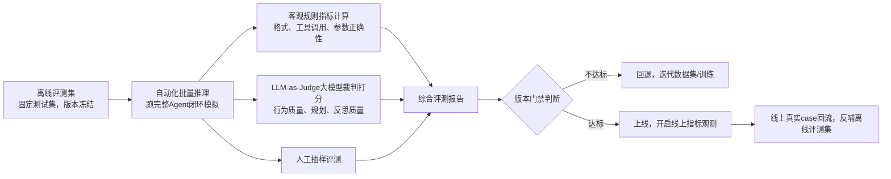

# 08 评测与基准 (Evaluation & Benchmarks)

> AgentBench、SWE-bench、评估方法、指标体系

**内容重点**: 评测体系，效果衡量

---

## 1. 本章定位
Agent评测是整个工程链路的**质量门禁**。普通大模型可以用loss、困惑度做指标；但Agent任务是交互式闭环，loss低不等于业务效果好。
很多项目只看训练loss，上线之后才发现大量工具调用失败、规划失效、反思失效。本章构建完整Agent评测体系：离线测试集、自动化评测、LLM‑as‑judge、人工评测、业务指标、版本发布门禁、开源基准。

> [!NOTE]
> 评测覆盖两个阶段：训练阶段离线验证；上线之后线上业务指标监控。离线评测用来做版本门禁，线上评测用来反馈迭代数据集。

## 2. Agent评测整体体系总览

## 3. 构建专属业务离线评测集

> 
> 通用开源benchmark不能完全替代业务私有评测集，业务垂直Agent必须自建私有测试集。

### 评测集样本分类

评测集需要均衡覆盖下面类别，样本固定冻结，版本跟随数据集版本管理，**禁止训练集query泄露进入评测集**。

| 样本类别 | 说明 | 占比参考 |
| --- | --- | --- |
| 单步简单工具调用 | 正常单工具成功场景 | 30% |
| 多步骤复杂任务 | 需要多轮toolcall、依赖前置结果 | 25% |
| 无需调用工具直接回答 | 不需要工具，模型直接输出答案 | 15% |
| 工具失败‑重试反思 | 工具报错、空返回，需要反思修正参数重试 | 20% |
| 边界异常case | 参数模糊、歧义query、非法输入 | 10% |

> 
> 评测集规模建议：原型阶段200‑500条；生产环境1000+条。评测集必须独立保存，**绝对不能混入训练集**。

每条测试样本元数据：

- user_query 用户输入
- expected_tools 预期应该调用/不调用工具
- expected_params 预期参数约束
- expected_outcome 任务预期结果
- difficulty 难度标签 easy/medium/hard
- case_type 样本类型标签

## 4. 客观可自动化规则指标（无主观，优先采集）

这一组指标不需要大模型裁判，脚本直接解析Agent输出与轨迹，是版本门禁第一门槛。

### L1 格式类指标

1. **toolcall_json_pass_rate**：工具调用JSON语法通过率；
2. thought_exist_rate：输出中包含推理thought片段占比；
3. parse_error_count：JSON解析失败总计数。

### L2 工具行为指标

1. correct_tool_selection_rate：工具选择正确率；
2. param_valid_rate：参数字段、类型语义合法率；
3. overcall_rate：过度调用工具占比（不需要工具却调用）；
4. refuse_call_rate：拒绝调用占比（需要工具却直接编造答案）。

### L3‑L4任务与反思指标

1. single_step_success_rate：单步任务成功率；
2. multi_step_success_rate：多步骤复杂任务完成率；
3. retry_correct_rate：失败之后重试修正的正确率；
4. max_iter_exceed_ratio：触发最大迭代轮次强制终止占比。

> 
> 发布门禁示例：
> 
> 
> - JSON通过率 ≥88%
> - 多步骤任务完成率达到业务基线
> - overcall_rate、refuse_call_rate不超过阈值

只要客观指标出现断崖下跌，直接判定版本不合格，不进入主观评测。

## 5. LLM‑as‑Judge 大模型裁判评测

客观规则只能检测格式、参数是否合法；无法评判思考质量、规划合理性、反思逻辑是否合理。
使用能力强的大模型作为裁判，对完整Agent轨迹做打分。

### Judge输入

把完整Agent会话轨迹（user query、thought、tool_call、observation、agent输出）全部送入裁判模型。

### Judge打分维度

1. Format：输出格式是否符合规范；
2. ToolDecision：工具调用决策合理性；
3. Planning：任务拆解规划质量；
4. Reflection：面对错误的反思与重试合理性；
5. FinalAnswer：最终结果是否满足用户需求。

输出格式建议输出结构化json，1‑5分，方便脚本统计。

> 
> 局限性：Judge本身存在幻觉与打分噪声。
> 缓解手段：
> 
> 
> 1. 同一个case跑2‑3次judge，取平均分；
> 2. 不要只依赖judge，必须搭配人工抽样校验。

### Judge最佳实践

- 尽量使用闭源强模型作为judge；
- judge样本做抽样人工校验，定期校准judge打分；
- judge结果作为辅助参考，不作为唯一门禁。

## 6. 人工评测流程

自动化无法覆盖全部语义边界，生产版本必须人工抽样。

抽样策略：

1. 总样本抽样5%‑10%；
2. 重点加权抽样：hard难度样本、失败case、边界case；

人工评测打分表维度：

1. 输出格式合规；
2. 工具调用决策合理；
3. 任务规划逻辑正确；
4. 反思处理错误合理；
5. 最终回答满足用户诉求。

输出：人工通过率报告，记录典型bad case，bad case回流到数据集，作为后续迭代样本。

## 7. 开源通用Agent Benchmark参考

通用基准用来做横向对比，**不能替代业务私有评测集**。

| Benchmark | 简介 | 适用场景 |
| --- | --- | --- |
| ToolBench | 大模型工具调用基准 | 工具调用能力评测 |
| GAIA | 真实世界复杂Agent任务 | 复杂问题、多步骤能力 |
| AgentBench | 多维度Agent综合基准 | Agent综合能力横向对比 |

> 
> 注意：很多开源benchmark任务分布和真实业务差异巨大，分数高不等于业务效果好。

## 8. 线上业务指标（上线后观测）

离线测试通过之后，上线持续观测真实业务埋点指标：

1. 会话任务完成率；
2. JSON解析失败率；
3. 工具调用成功率；
4. 过度调用、拒绝调用占比；
5. 会话终止原因分布：完成 / 达到最大轮次 / 异常报错；
6. 用户反馈负向case数量。

线上bad case处理流程：

1. 埋点采集会话完整轨迹；
2. 过滤无效脏会话；
3. 人工标注bad case根因；
4. 一部分case加入训练数据集；一部分case加入离线评测集作为回归case。

> 
> 回归case：曾经出现过的bug，加入评测集，后续新版本发布必须保证该case不再复现。

## 9. 完整版本发布门禁流程

1. 训练完成后，在冻结离线评测集跑完整Agent闭环模拟；
2. 校验客观规则指标，不满足基线直接打回；
3. 执行LLM‑as‑Judge评测；
4. 人工抽样评测；
5. 对比上一版本基线：指标不能出现大幅退化；
6. 全部门禁通过，才允许上线；
7. 上线后持续观测线上指标。

> 
> 重要原则：**允许小幅指标波动，禁止断崖退化**。一旦出现能力断崖退化，回退上一个可用版本，排查训练、数据集、工程问题。

## 10. 评测高频坑清单

1. ❌ 训练集样本泄露进入评测集，离线指标虚高；👉 严格隔离数据集与评测集，做query去重校验；
2. ❌ 只看loss，不跑Agent闭环评测；loss下降不代表Agent行为正确；👉 必须跑完整闭环模拟；
3. ❌ 完全依赖LLM‑as‑Judge，没有人工校验；judge打分存在噪声幻觉；👉 judge搭配人工抽样；
4. ❌ 只用通用开源benchmark，没有业务私有评测集；通用基准与业务分布不一致；👉 自建业务评测集；
5. ❌ 离线评测通过，线上不做指标监控；线上分布偏移无法感知；👉 上线持续观测埋点指标；
6. ❌ bad case不沉淀为回归测试用例；同一个bug反复复现；👉 bad case沉淀进评测集做回归。

## 11. 本章小结

1. Agent不能只依靠loss评估，必须运行完整交互式Agent闭环进行评测。
2. 评测体系：客观规则指标（优先门禁）+ LLM‑as‑Judge辅助打分 + 人工抽样评测。
3. 业务私有离线评测集必不可少，严格与训练集隔离；bad case沉淀回归用例。
4. 通用benchmark仅做横向参考，不能替代业务评测。
5. 线上指标监控 + case回流，完成评测‑数据集迭代闭环。

下一篇：**09‑Production‑Troubleshooting.md**，讲解Agent生产问题排查：问题分类、排查链路、典型故障案例、调优决策树、应急回退策略。

