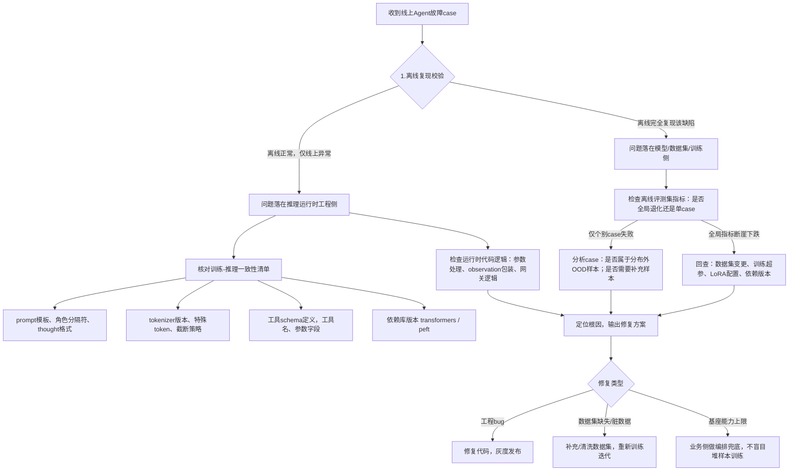

# 09 代码、数据与资源 (Code, Data & Resources)

> 开源代码、数据集、工具链、预训练模型

**内容重点**: 资源汇总，工具推荐

---

## 1. 本章定位
Agent上线进入生产环境后，会遇到各类故障：输出格式异常、工具调用错乱、任务完不成、复现时好时坏、版本迭代能力退化。
Agent故障根因横跨四大域：**数据集、模型权重、训练脚手架、推理运行时基础设施**，很多故障现象相似，但根因完全不同。
本章给出标准化排查决策树、故障分类、典型案例、应急回退策略、生产调优原则，用于线上问题定位与复盘。

> [!NOTE]
> 很多现象表面看是模型“笨”，实际是工程bug；不要一遇到bad case就直接往数据集里堆样本。

## 2. 故障整体分类
Agent生产故障分为四大类别，排查优先区分类别：

1. **工程类故障（占线上故障大头）**
训练‑推理不一致、tokenizer行为变化、schema不匹配、模板错误、运行时代码bug、依赖版本漂移。
现象：同样query，离线推理正常，线上异常；或版本升级后批量出问题。

2. **数据集‑训练侧故障**
脏样本、分布倾斜、过拟合、遗忘旧能力、DPO超参不合理、数据集与业务真实分布偏移。
现象：离线评测已经复现缺陷；新版本对比基线指标断崖下跌。

3. **模型固有能力约束**
基座本身推理上限，长上下文丢失、复杂规划能力不足。
现象：少量高难度case持续失败，普通case表现正常；增加样本收益有限。

4. **线上环境分布偏移**
线上用户输入、工具返回结果大量不在训练集覆盖范围。
现象：离线评测指标很漂亮，线上大量新bad case。

## 3. 标准化排查决策流程（可直接用于团队SOP）

> 关键判断点：**相同输入，离线本地推理是否可以复现故障**，这一步快速分割是权重问题还是运行时代码问题。

## 4. 高频典型故障案例与根因对照表

|故障现象|可能根因|排查验证点|修复方案|
|---|---|---|---|
|线上大量JSON解析失败；离线跑模型输出完全正常|训练推理prompt模板不一致；线上schema变更；tokenizer行为改变|打印tokenizer编码后完整prompt文本，线上线下对比|统一公共模板组件，三方共用；锁定依赖版本；schema统一维护|
|DPO训练发布之后，JSON格式通过率断崖下跌|DPO beta过大；DPO使用ZeRO‑3；DPO数据集rejected存在非法JSON|查看离线评测格式指标；检查dpo配置与数据集|调小beta；DPO固定ZeRO‑2；过滤非法rejected样本|
|Agent无限循环反复调用相同工具参数|运行时未设置最大迭代轮次；模型不会识别失败；观测返回格式异常|查看会话埋点，看observation返回内容|运行时强制最大迭代轮次；数据集补充失败反思重试轨迹；修正observation包装格式|
|不需要调用工具时依然疯狂调用工具|训练集中缺少“直接回答”类型样本；线上query分布偏移|统计数据集样本类型占比；线上埋点统计overcall_rate|补充no_tool样本；DPO增加过度调用作为rejected偏好对|
|明明需要调用工具，模型直接编造答案拒绝调用|训练集缺少该工具场景；工具schema字段过于复杂；分布偏移|检查训练集是否覆盖该业务场景|扩充对应场景轨迹；简化工具schema；DPO偏好样本补充|
|多步骤任务总是做一半中断|长轨迹样本不足；基座上下文能力有限；上下文截断策略不合理|离线跑多步骤评测case|补充多步长轨迹样本；调整上下文窗口与截断策略；上层编排做业务兜底|
|新版本部分旧能力退化遗忘|epoch过大过拟合；新增数据集引入冲突样本；DPO超参激进|对比新旧版本离线评测全套指标|回退超参；清洗冲突样本；增加旧场景回归测试case|
|时好时坏，同一个query偶尔正常偶尔出错|随机种子未固定；推理采样温度过高；输入文本存在不可见特殊字符|固定seed；降低temperature；清洗输入脏字符|推理阶段降低temperature；输入预处理清洗脏字符|

## 5. 生产应急回退策略
Agent系统上线，必须具备快速回退预案，出现大面积故障执行如下流程：

1. **现象确认**：看埋点大盘指标：JSON失败率、任务完成率是否大面积恶化，区分是局部case还是全局故障。
2. **第一优先级：权重版本回退**
    - 如果是模型新版本发布之后出现全局恶化：直接切回上一个验证通过的LoRA/模型版本，不等待定位根因。
3. **其次运行时开关降级**
    - 开启网关层防护兜底：JSON解析容错、工具调用次数上限；
    - 必要时切流量到老的Agent服务。
4. **故障隔离定位**
    - 回退流量稳定之后，再复现问题，定位是数据集、训练还是工程bug。
5. **禁止做法**：线上出问题，紧急调超参、临时凑样本快速重训上线，容易引入二次故障。

> 原则：**先止损，后定位，再修复迭代**。

## 6. 训练‑推理一致性核查清单（故障排查必跑）
出现任何线上线下表现不一致，逐项核对：
1. ✅ tokenizer：版本、pad_token、eos_token、特殊token完全一致
2. ✅ message拼接模板：角色、分隔符、thought、toolcall输出格式完全一致
3. ✅ observation工具返回文本包装格式，送入模型的字符串格式
4. ✅ 工具schema：工具名称、参数字段定义，训练数据集与MCP网关完全一致
5. ✅ 上下文最大长度、截断策略、padding逻辑
6. ✅ transformers、peft、bitsandbytes版本，训练环境与推理环境尽量对齐

> 最佳实践：写一个校验脚本，输入同一条query，输出训练预处理文本、推理输入文本，做字符串对比。

## 7. 故障case归档流程
每一个线上bad case必须归档，用于后续回归：
1. 保存完整会话原始日志：user query、thought、tool_call、observation、最终输出；
2. 打上根因标签：`dataset_dirty` / `template_bug` / `schema_mismatch` / `model_cap_limit` / `ood_distribution`；
3. 分类处理：
    - 工程bug：修复代码，case加入单元测试；
    - 数据集缺失：清洗后加入训练集，同时加入离线评测集作为回归case；
    - OOD分布外case：优先上层编排兜底，不强行喂给模型训练；
4. 后续新版本训练发布，回归case必须全部通过。

> 同一个bug反复复现，大多是没有沉淀回归测试用例。

## 8. 调优决策原则（避免错误迭代）
1. 不要上来就加样本：先区分是工程bug还是模型能力缺陷；工程问题加样本完全无效。
2. 不要盲目加大epoch、加大学习率来“提升效果”，极易引发能力遗忘、过拟合。
3. 遇到分布外OOD case：优先运行时/编排层兜底，不要强行把极端case大量灌入训练集，会污染整体分布。
4. DPO训练不要一味调大beta，beta过高会破坏原有SFT习得的格式范式。
5. 基座本身能力天花板的场景，不要无限堆样本，接受模型上限，靠上层业务编排弥补。

## 9. 本章小结
1. Agent故障分为四大类：工程故障、数据集训练故障、模型固有能力约束、线上分布偏移；离线复现是区分权重与运行时bug的关键。
2. 标准化排查决策树，优先核对训练‑推理一致性，这是线上故障最高发来源。
3. 生产环境要有应急回退预案：先止损，再定位根因。
4. bad case需要归档，沉淀回归测试用例，防止同类bug重复出现。
5. 调优前先定位根因，不要遇到bad case就直接往数据集追加样本。

下一篇：**10‑Agent‑Project‑Playbook.md**，完整Agent项目实战手册：项目全生命周期、里程碑规划、人力分配、风险点、交付物清单，适合作为awesome‑ai‑knowledge仓库的总实践指南。
